---
meta:
  - name: description
    content: Create a First Draft and make the most out of your client relationships by adding our open source markup language to your legal agreements.
---

# Beginner’s Guide

## Creating a First Draft

Manually drafting legal agreements is costly, inefficient, and increases the risk of errors in the drafting process. With our legal automation tools, anyone can turn complex and static legal documents into dynamic, fill-in templates with the click of a button. Create a First Draft and make the most out of your client relationships by adding some of our basic markup language features to your legal agreements. For more information on these features and instructions on how to use all of our markup language, check out the [complete guide](/markup-language/).

## Automate Legal Agreement Terms

### Step 1: "Start a New Template" or Go to the "Edit" View of any Template

The OpenLaw markup language can be added to your legal agreement by first clicking on "Start a New Template" in the nav menu:

<center>
  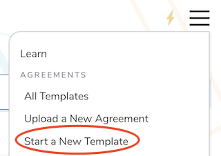
</center>

_or_ by going to an existing template's "Edit" view, which is accessible in the action toolbar for that template.

<center>
  
</center>

### Step 2: Bracket Desired Text

Easily transform any word or phrase in your legal agreement into a fill-in field by surrounding the text with a set of double brackets. Adding double brackets around legal prose transforms natural language into machine-readable objects called variables. Consider the following basic contractual language from a mutual non-disclosure agreement (NDA):

```
This Mutual Non-disclosure Agreement (this “Agreement”) is entered into as of
March 20, 2019 (the “Effective Date”), by and between ABC, Inc., a Delaware
corporation with its principal place of business at 123 Street, New York, NY
11111 (the “Company”) . . .
```

Replacing `March 20, 2019` with `[[Effective Date: Date]]` results in:

<center>
  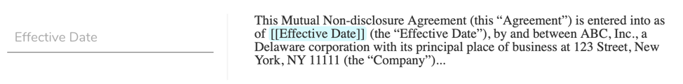
</center>

Replacing `ABC, Inc.` with `[[Company Name]]` results in:

<center>
  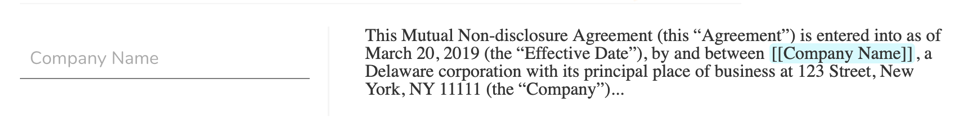
</center>

Replacing `123 Street, New York, NY 11111` with `[[Company Address: Address]]` results in:

<center>
  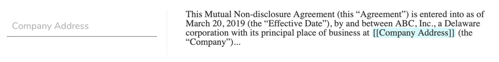
</center>

## Creating Descriptive Fill-in Fields

One can vary the text that appears in the automatically generated form by including the desired description in the bracketed field. Simply add the desired language in quotes in the bracketed field after the defined text. If you would like to see "What is the name of the Company?" in the fill-in field, simply add `[[Company Name "What is the name of the Company?"]]` wherever you would like to see it in the text of the edit view of the agreement. This will result in:

<center>
  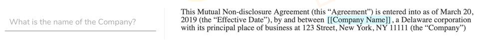
</center>

## Creating Fill-in Fields that Contain More Text Space

If you would like to create a fill-in field that appears as a large text box, simply add `: LargeText` after the defined term. For example, `[[Type Information Here: LargeText]]` results in the following:

<center>
  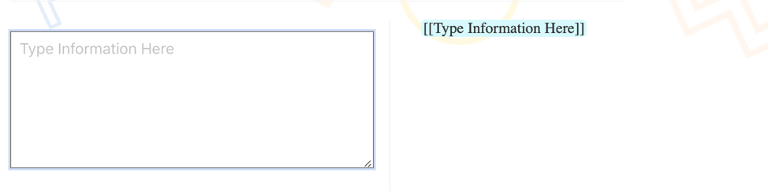
</center>

## Creating Auto-fill Fields

If there is a field that you would like to be auto-filled with a word or phrase, add double brackets around the desired text and add `: Text`, followed by the desired output in quoted parenthesis. For example, `[[Governing Law: Text("State of New York")]]` will fill in the field with "State of New York." Users filling in the template will still have the option to change the fill-in field when filling out the template.

<center>
  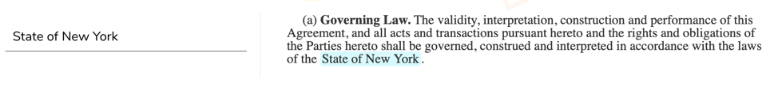
</center>

## Number Fields

Adding `: Number` after the defined text will indicate that the automated fill-in field should be an integer or decimal number. For example, `[[Purchase Price: Number]]` will display numbers with appropriate commas.

<center>
  
</center>

## Date Fields

Adding `: Date` after the defined text name will transform your fill-in field into an easy-to-use date picker, which will display month, day, and year. For example, `[[Effective Date: Date]]` becomes:

<center>
  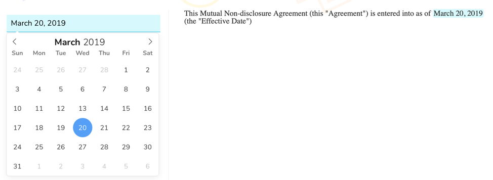
</center>

## Date and Time Fields

If you are seeking to set a specific date and time, adding `: DateTime` after the defined text name will create a date picker that allows you to choose the date and time to be included in a First Draft. For example, adding `[[End Date: DateTime]]` will result in a menu similar to the following:

<center>
  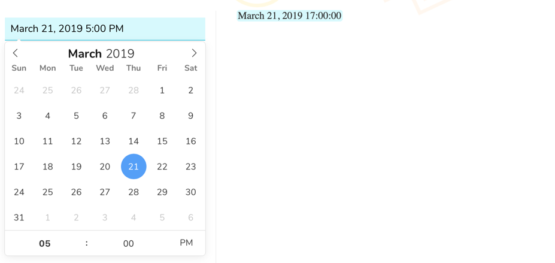
</center>

## Address Fill-in

The address fill-in transforms a fill-in field into an address bar that allows you to search for an address using the Google Maps API. Simply add `: Address` after your defined text name. For example, `[[Buyer Address: Address]]` becomes:

<center>
  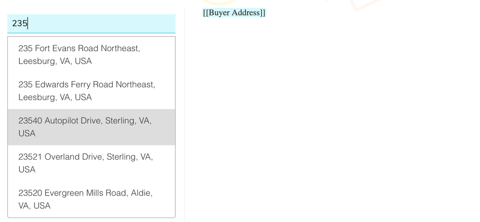
</center>

## Including an Ethereum Address

To include an Ethereum address fill-in field, add `: EthAddress` after the defined text. Including `: EthAddress` requires the individual who is filling in the template to add a valid Ethereum address in the fill in field. The fill-in field will appear the same as any other defined text variable where a user may fill in the desired address. For example, `[[Ethereum Address: EthAddress]]` becomes:

<center>
  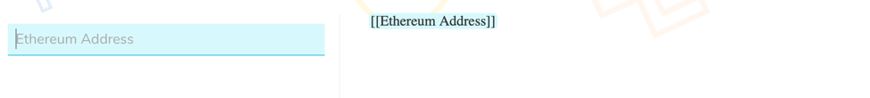
</center>

## Adding Images

To upload an image, add `: Image` after the defined text. For example, `[[Company Logo: Image]]` creates a button that permits you to search your files and upload any image.

<center>
  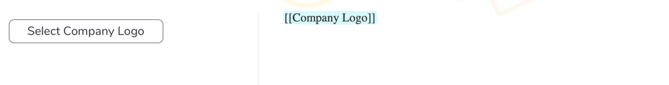
</center>

## Drop-down Menus

Add drop-down menus into your template by following the steps below.

### Step 1: Add Sample Drop-down

Copy and paste the following into your template:

```
[[Choice Variable Name: Choice("option 1", "option 2", "option 3")]]
[[Selected Option Variable Name: Choice Variable Name]]
```

_or_

Select the boxed arrow in the editor toolbar of any template:

<center>
  
</center>

### Step 2: Define What You Would Like Your Drop-down Menu to Ask

The `Choice Variable Name` in the sample drop-down menu is how you can define the text name. Remember to choose the same text name for both fields.

`Selected Option Variable Name` is where you add what you would like to include above the drop-down menu.

For example,

```
[[Entity: Choice("corporation", "limited liability company", "limited partnership", "public benefit corporation")]]
[[Company Entity Type: Entity]]
```

creates a drop-down menu allowing the user to choose what entity type should be included in the template. The example above will result in the following drop-down menu:

<center>
  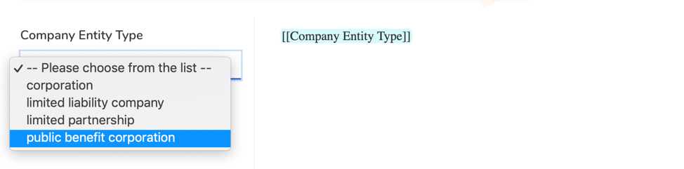
</center>

### Step 3: Include the Drop-down Menu within the Text of an Agreement

At the very top of the template, add the following:

```
<%
[[Entity: Choice("corporation", "limited liability company", "limited partnership", "public benefit corporation")]]
[[Company Entity Type: Entity]]
%>
```

When you get to the text where you would like to have a drop-down menu, include the second bracketed item from above. Simply add `[[Company Entity Type: Entity]]` in the template editor similar to the following:

<center>
  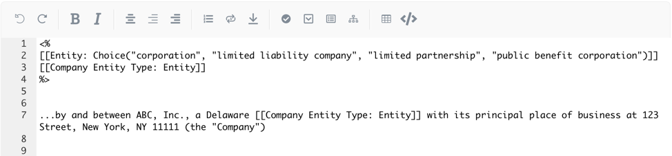
</center>

The above markup results in the drop-down menu below.

<center>
  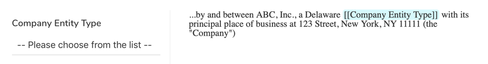
</center>

## Conditional Responses

Adding conditionals allows users to select what language is included in a First Draft. When a user selects "Yes", the conditional will output the selected information that you have decided to include in the conditional.

### Step 1: Add Sample Conditional

Copy and paste the following into your template:

```
{{Name of Conditional “Question to Prompt User?” =>
Text that you would like to include if a user selects 'yes'}}
```

_or_

Select the check mark circle in the editor toolbar of any template:

<center>
  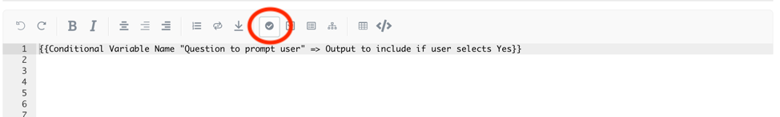
</center>

### Step 2: Name the Conditional and Add the Desired Language to be Inserted when a User Selects "Yes"

If you would like the user to have the option to include a specific provision such as an affiliate provision, simply include the text after the arrow `=>`.

For example,

```
{{Affiliate Definition “Would you like to include a definition for an Affiliate?” =>
“Affiliate” shall mean an affiliate of, or person affiliated with, a specified
person, is a person that directly, or indirectly through one or more intermediaries,
controls or is controlled by, or is under common control with, the person specified.}}
```

will result in the following:

<center>
  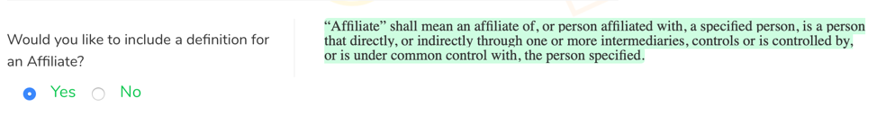
</center>

## Signatures

Including electronic signature markup within a template allows any party to electronically sign the agreement through an email identity. An electronic signature can be embedded into an agreement template by including `: Identity | Signature` after a variable name as shown in the following example:

```
**[[Party A | Uppercase]]**

[[Party A Signatory Email: Identity | Signature]]

_______________________
By: [[Party A Signatory Name]]
Title: [[Party A Signatory Title]]

**[[Party B | Uppercase]]**

[[Party B Signatory Email: Identity | Signature]]

_______________________
By: [[Party B Signatory Name]]
Title: [[Party B Signatory Title]]
```

## Formatting

### Bold

To bold text, simply add two asterisks `**` both before and after the relevant language. For example, `**This Agreement**` becomes "**This Agreement**" in the agreement text.

### Italic

If you would like to italicize text, you can simply add one asterisks `*` both before and after the relevant language. For example, `*however*` becomes "_however_" in the agreement text.

### Bold and Italic

For this type of formatting, simply surround the relevant text with three asterisks `***` both before and after the relevant language. For example, `***emphasized text***` becomes "_**emphasized text**_" in the agreement text.

### Uppercase

To display text in all caps, simply add `| Uppercase` after the defined text. For example, `[[Party A | Uppercase]]` becomes "PARTY A" in the agreement text.

## Alignment

### Centered

To center text such as titles and headings, add `\centered` before the relevant text. For example, `\centered **Agreement Title**` will center and bold the relevant text in the agreement.

### Right Align

To right align text, add `\right` before the relevant text.

### Other Alignment Options

Adding `\right-three-quarters` before the relevant text will position the text to be three-quarters aligned to the right. This may be helpful in positioning signature blocks in an agreement.

## Page Break

If you would like to add a page break to an agreement, such as separating an exhibit from the main body of the agreement, you can simply add `\pagebreak` where the break should be located in the template.

## Sections and Subsections

Organizing an agreement into sections and subsections is straightforward. Currently, we offer four section levels, which can be invoked using the appropriate number of `^` before the section heading.

For example,

```
^First Level

^^Second Level

^^^Third Level

^^^^Fourth Level
```

will result in the following:

<center>
  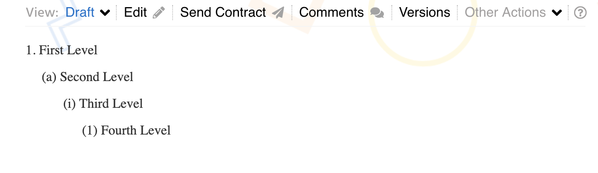
</center>
