---
meta:
  - name: description
    content: With OpenLaw's Forms & Flows, you can take any legal agreement and turn it into a questionnaire or simple form. Entire workflows can be created to manage the life cycle of a commercial agreement.
---

# Forms & Flows Overview

The life cycle of commercial arrangements is complex, often requiring multiple people's input and approval to kick things off and different phases of performance. During the process, agreements take too long to prepare, get stuck with "legal" and worse—their valuable data is not plugged into other systems for more productive use.

With OpenLaw's Forms & Flows, you can take any legal agreement and turn it into a questionnaire or simple form in a couple of clicks. Multiple people can fill out the form and entire workflows can be created to manage the life cycle of a commercial agreement.

Commercial relationships no longer need to be complex. Generate agreements, send e-mail reminders about renewals, and save information related to agreements with ease.

## Technical Overview

An agreement template is a great way to define a contract and the actions that should come with it. But sometimes you need an extra layer to define the workflow that happens before the contract is created. This is the main purpose of the Flow. To define how to create contract(s) and what steps need to happen to get there.

### Flow Template

Similar to agreement templates created with our [markup language](/markup-language/), a Flow template has special syntax to create a form view and workflow for an existing agreement template.

A Flow consists of the following elements (with examples of each element for a Flow that is linked to a variation of the Employee Offer Letter template that can be found at https://app.openlaw.io):

#### Title

A unique title to identify the Flow, similar to an agreement template title.

```
Employment Agreement Form & Flow
```

#### Template

A Flow is linked to an already existing agreement template on the same OpenLaw instance where the Flow is created. As further explained below, the Flow can define how the agreement template variables are organized to present a unique form view to the end user. The Flow can also define `Edit` actions regarding who can fill out the form and populate the agreement variables.

```
Employee Offer Letter
```

#### Description (optional)

An optional description can be included to give the end user information about the form and workflow, such as the purpose or instructions.

```
Fill out the form below to generate the Employee Offer Letter.

We'll get you through this in a matter of minutes and send off a completed
document to your HR representative who will provide you more information for the
hiring process.
```

::: tip
You can include line breaks as shown in the example above to display paragraphs. You can also include links using the following syntax:

```
[link text](https://www.mysite.com)
```

The URL must begin with either `https://` or `http://`.
:::

#### Form Sections

A definition and organization of the variables included in the agreement template. Regardless of how the variables are organized in the agreement template, the variables can be independently defined in a Flow template to customize how they are grouped and in what order they appear in the rendered form. Each form section has a **title**, **description (optional)**, and a listing of **variables**.

```
==
title: Effective Date
description: The date on which the agreement will take effect
variables:
Effective Date
==
title: Company Information
description: Information about the Company and HR representative
variables:
Company Name,
Company Address,
Company Signatory First Name,
Company Signatory Last Name,
Company Signatory Position
==
title: Employee Information
description: Information about the employee
variables:
Employee First Name,
Employee Last Name,
Employee Address,
Employee Position,
Position of Supervisor,
Payment Start Date,
Payment End Date,
Salary in Ether,
Recipient Address,
Employee Responsibilities,
Days of Vacation
==
title: Other Agreements
description: Supporting documents for employment
variables:
Additional Agreements,
Confidentiality Agreement,
Dispute Resolution,
Governing Law
==
title: Employee Signature
description: Email address for Employee signatory
variables:
Employee Signatory Email
==
title: Company Signature
description: Email address for Company signatory
variables:
Company Signatory Email
==
```

::: tip
The optional **description** for each form section can include line breaks to display paragraphs. They can also include links using the following syntax:

```
[link text](https://www.mysite.com)
```

The URL must begin with either `https://` or `http://`.
:::

#### Roles (optional)

List of identifiers that can be assigned to users. Access to actions in a Flow (described below) are given to certain roles.

```
admin, HR, legal, employee
```

#### Actors (optional)

The users who can interact with the Flow execution. Each actor is identified by an email address and has assigned roles that have been defined in the Flow template.

```
- company@example.com: admin, HR, legal
- employee@example.com: employee
```

#### Action

An action is something you can do to a Flow execution. This currently includes:

1. editing the parameters (filling out the form fields)
2. attaching a file (useful to include a supporting document to the form and generated agreement)
3. providing a required approval in the workflow process
4. sending an email related to the workflow
5. creating a contract that is sent out for signature

Each action is defined with a name, type (e.g., `Edit`, `Attach`, `Approval`, `Email`, `Contract`), the roles/actors permitted to take the action, and other required information depending on the type.

```
- complete employee portion: Edit(
  roles: employee;
  forms: Employee Information, Employee Signature)

- complete company portion: Edit(
  roles: admin, HR;
  forms: Effective Date, Company Information, Other Agreements, Company Signature)

- supporting document: Attach(
  roles: employee;
  type: *;
  description: "Upload your resume in Word or PDF format.")

- company review: Approval(roles: HR, legal)

- send completed form: Email(
  subject: "Employee Offer Letter Form completed";
  body: "The Employee Offer Letter form has been completed and ready for review.";
  to: admin, HR, legal, employee)

- send request to revise: Email(
  subject: "Employee Offer Letter Form rejected";
  body: "The Employee Offer Letter form needs to be updated.";
  to: admin, HR, legal, employee)

- send approval confirmation: Email(
  subject: "Employee Offer Letter Form approved";
  body: "The Employee Offer Letter form has been approved and the contract has been sent.";
  to: admin, HR, legal, employee)

- send contract: Contract(creator: company@example.com)
```

#### Action Rules / Flow Graph

The set of rules that define when an action is triggered. Includes references to the actions that have been defined in the Flow template.

```
when the flow starts then
- requires "complete employee portion"

when "complete employee portion" is done then
- requires "supporting document"

when "supporting document" is done then
- requires "complete company portion"

when "complete company portion" is done then
- do "send completed form"
- requires "company review"

when "company review" is rejected then
- reset "complete employee portion"
- reset "supporting document"
- reset "complete company portion"
- reset "company review"
- do "send request to revise"
- requires "complete employee portion"

when "company review" is approved then
- do "send approval confirmation"
- do "send contract"
```

### Full Flow Template Example

The examples above can be combined to create a full Flow template in the editor.

```
roles: admin, HR, legal, employee

actors:
- company@example.com: admin, HR, legal
- employee@example.com: employee

template: Employee Offer Letter

forms:
Fill out the form below to generate the Employee Offer Letter.

We'll get you through this in a matter of minutes and send off a completed document to your HR representative who will provide you more information for the hiring process.
==
title: Effective Date
description: The date on which the agreement will take effect
variables:
Effective Date
==
title: Company Information
description: Information about the Company and HR representative
variables:
Company Name,
Company Address,
Company Signatory First Name,
Company Signatory Last Name,
Company Signatory Position
==
title: Employee Information
description: Information about the employee
variables:
Employee First Name,
Employee Last Name,
Employee Address,
Employee Position,
Position of Supervisor,
Payment Start Date,
Payment End Date,
Salary in Ether,
Recipient Address,
Employee Responsibilities,
Days of Vacation
==
title: Other Agreements
description: Supporting documents for employment
variables:
Additional Agreements,
Confidentiality Agreement,
Dispute Resolution,
Governing Law
==
title: Employee Signature
description: Email address for Employee signatory
variables:
Employee Signatory Email
==
title: Company Signature
description: Email address for Company signatory
variables:
Company Signatory Email
==

actions:
- complete employee portion: Edit(
  roles: employee;
  forms: Employee Information, Employee Signature)

- complete company portion: Edit(
  roles: admin, HR;
  forms: Effective Date, Company Information, Other Agreements, Company Signature)

- supporting document: Attach(
  roles: employee;
  type: *;
  description: "Upload your resume in Word or PDF format.")

- company review: Approval(roles: HR, legal)

- send completed form: Email(
  subject: "Employee Offer Letter Form completed";
  body: "The Employee Offer Letter form has been completed and ready for review.";
  to: admin, HR, legal, employee)

- send request to revise: Email(
  subject: "Employee Offer Letter Form rejected";
  body: "The Employee Offer Letter form needs to be updated.";
  to: admin, HR, legal, employee)

- send approval confirmation: Email(
  subject: "Employee Offer Letter Form approved";
  body: "The Employee Offer Letter form has been approved and the contract has been sent.";
  to: admin, HR, legal, employee)

- send contract: Contract(creator: company@example.com)

when the flow starts then
- requires "complete employee portion"

when "complete employee portion" is done then
- requires "supporting document"

when "supporting document" is done then
- requires "complete company portion"

when "complete company portion" is done then
- do "send completed form"
- requires "company review"

when "company review" is rejected then
- reset "complete employee portion"
- reset "supporting document"
- reset "complete company portion"
- reset "company review"
- do "send request to revise"
- requires "complete employee portion"

when "company review" is approved then
- do "send approval confirmation"
- do "send contract"
```

### Flow Execution

When a user starts a Flow, a new execution gets created. An execution is linked to its Flow template by a flowId and version. Each Flow execution also has a state. This is where all the information such as the agreement variable inputs and the execution state of the Flow are stored.

### Forms Template

If you don't really have a need for the actions and executions of a fully defined workflow, you still can use the "forms" feature to turn any agreement template into a customizable questionnaire or simple form.

A forms template is a stripped down version of a Flow template with the following implicit default values:

- one actor which is the user who starts the Flow
- one `Edit` action for all the form sections which is assigned to the only actor

### Forms Template Example

Below is an example of how a forms template can be defined and saved in the editor. Note that the optional **roles**, **actors**, **actions**, and **flow graph** sections have been omitted.

```
template: Employee Offer Letter

forms:
Fill out the form below to generate the Employee Offer Letter.

We'll get you through this in a matter of minutes and send off a completed document to your HR representative who will provide you more information for the hiring process.
==
title: Effective Date
description: The date on which the agreement will take effect
variables:
Effective Date
==
title: Company Information
description: Information about the Company and HR representative
variables:
Company Name,
Company Address,
Company Signatory First Name,
Company Signatory Last Name,
Company Signatory Position
==
title: Employee Information
description: Information about the employee
variables:
Employee First Name,
Employee Last Name,
Employee Address,
Employee Position,
Position of Supervisor,
Payment Start Date,
Payment End Date,
Salary in Ether,
Recipient Address,
Employee Responsibilities,
Days of Vacation
==
title: Other Agreements
description: Supporting documents for employment
variables:
Additional Agreements,
Confidentiality Agreement,
Dispute Resolution,
Governing Law
==
title: Employee Signature
description: Email address for Employee signatory
variables:
Employee Signatory Email
==
title: Company Signature
description: Email address for Company signatory
variables:
Company Signatory Email
==
```

## Creating a Form & Flow

To create a new Flow (with its form view) in an OpenLaw instance, click on "Create a New Flow" in the nav menu.

<center>
  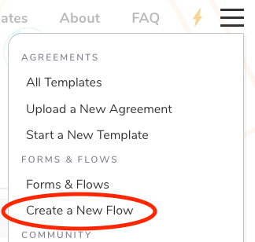
</center>

To make things easier, we have created a populate modal that breaks down all the required and optional information for you to enter to create a new Flow.

<center>
  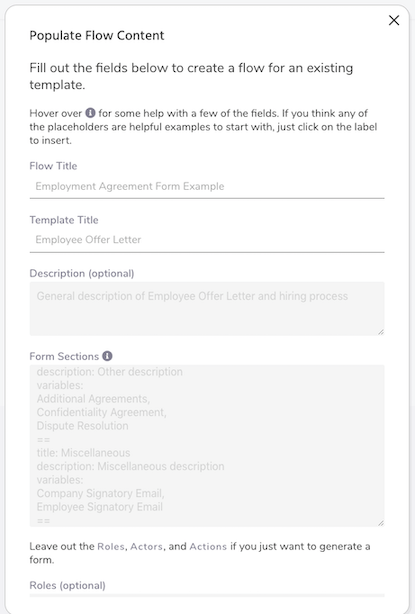
</center>

::: tip
If your Flow is linked to an agreement template that already has [variable groupings](/markup-language/#groupings), you can click on the blue button next to the "Form Sections" label to start with those defined sections.

<center>
  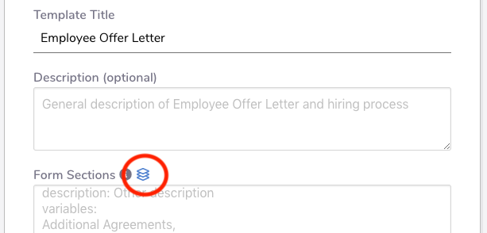
</center>
:::

After you have submitted the required information in the modal, the Flow syntax will be populated in the editor where you can make further edits before saving and then clicking on the "Back" button to view the created form.

<center>
  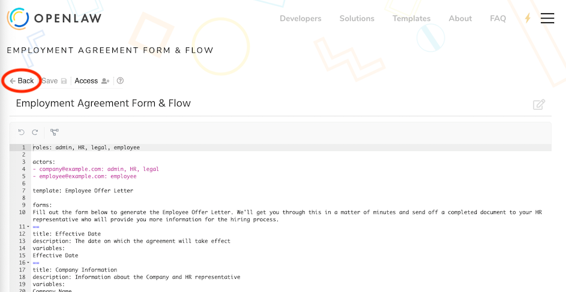
</center>

## Setting Access Permissions

The Flow creator can set the access permissions for who can view and edit the Form & Flow by first clicking on the "Access" button at the top of the Flow editor.

<center>
  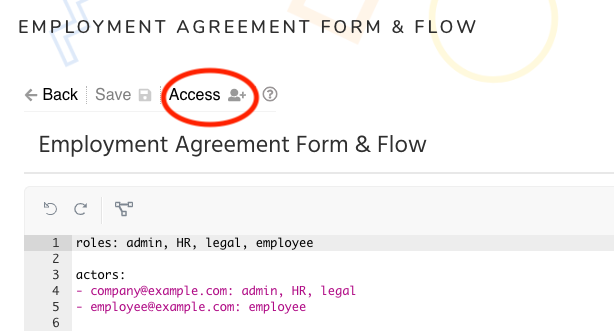
</center>

In the access permissions modal, you can specify other users to have edit and view access to your created Form & Flow. You can also choose to make edit and/or view permissions available to all registered users.

If you would like to allow unregistered users to view and fill out the form (without edit access), you can generate a shareable link. Anyone who has access to that link can click on it to open the form.

<center>
  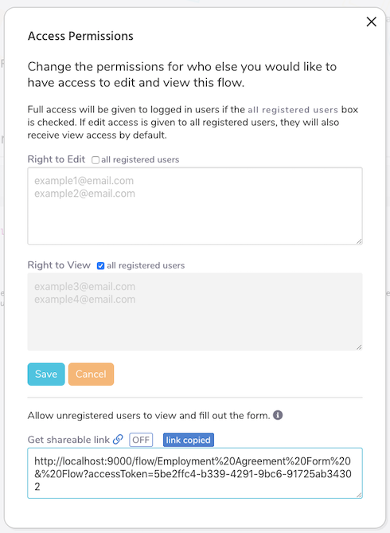
</center>

## Viewing and Using a Workflow

To see the list of Flows that you have access to, click on "Forms & Flows" in the nav menu. Check out some examples of created Flows at https://app.openlaw.io/flows.

<center>
  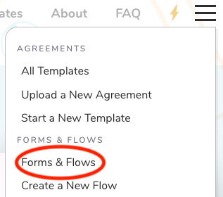
</center>

After you open a Flow, you'll see its list of defined actions in a panel that highlights the current and completed actions. The main workflow panel will display the current action.

<center>
  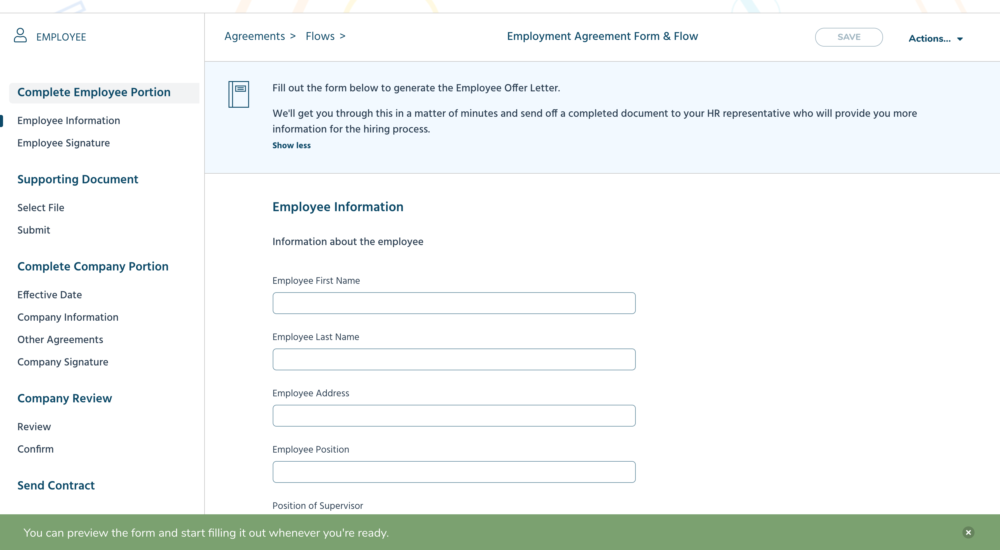
</center>

Filling out a form is straightforward and similar to how you would fill out the fields for an agreement template. The main panel has a top header bar that includes a button to save your inputs and a progress bar that comes into view when the form page requires scrolling down.

As you input information into the form fields, the progress bar will automatically update to let you know how far along you are in completing the form sections included in the current `Edit` action. In the case of a forms template where no actions have been defined, the progress bar shows the progress made on the entire form.

<center>
  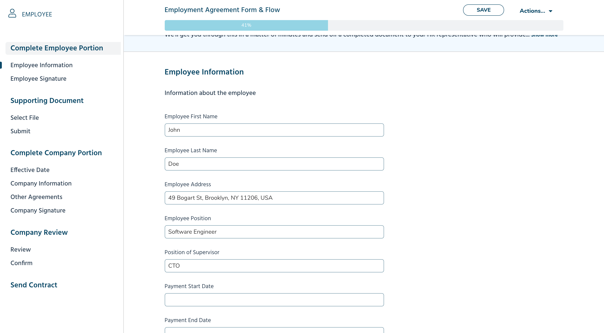
</center>

After you have completed all of the form fields and have reached the last form section, you will see the option at the bottom to "Submit" the form.

<center>
  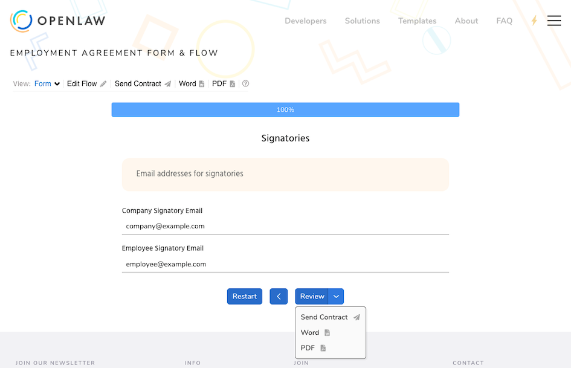
</center>

In an `Attach` action, the user is prompted to select and submit a file to attach it to the workflow.

<center>
  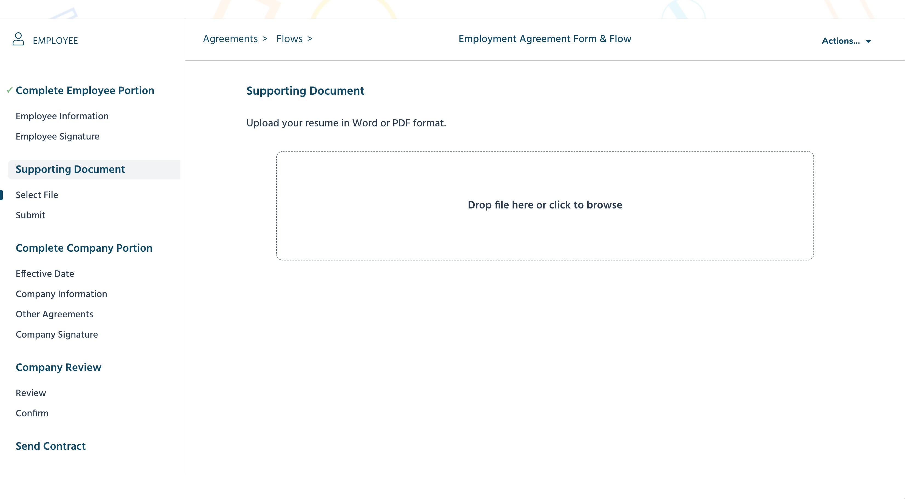
</center>

In the case where a user is not authorized for the current action, the user is notified of which party needs to complete the pending action.

<center>
  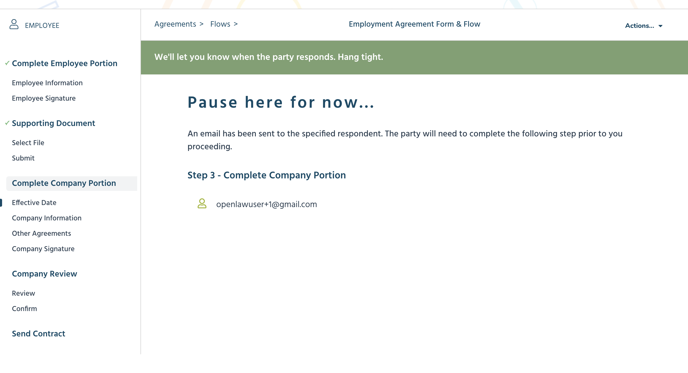
</center>

In an `Approval` action, the user can preview the contract that will be generated with the form inputs.

<center>
  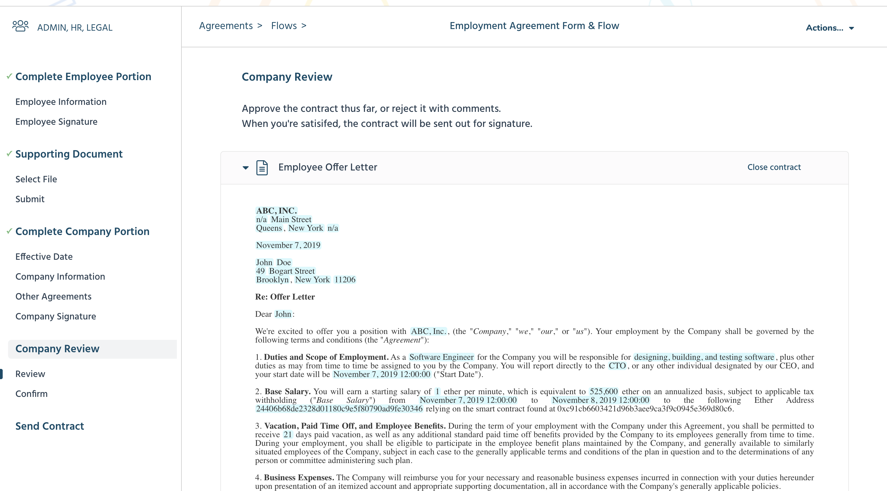
</center>

The reviewer can also see any files that have been attached and review all the completed form sections. The reviewer has permission to change any of the form inputs before approving or rejecting the form.

<center>
  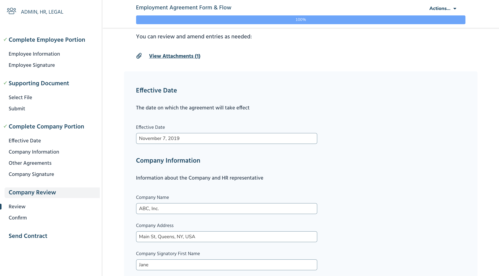
</center>

The reviewer can then click on either the "Approve" or "Reject" button at the bottom of the page to open a modal where optional comments can be submitted before confirming the selection.

<center>
  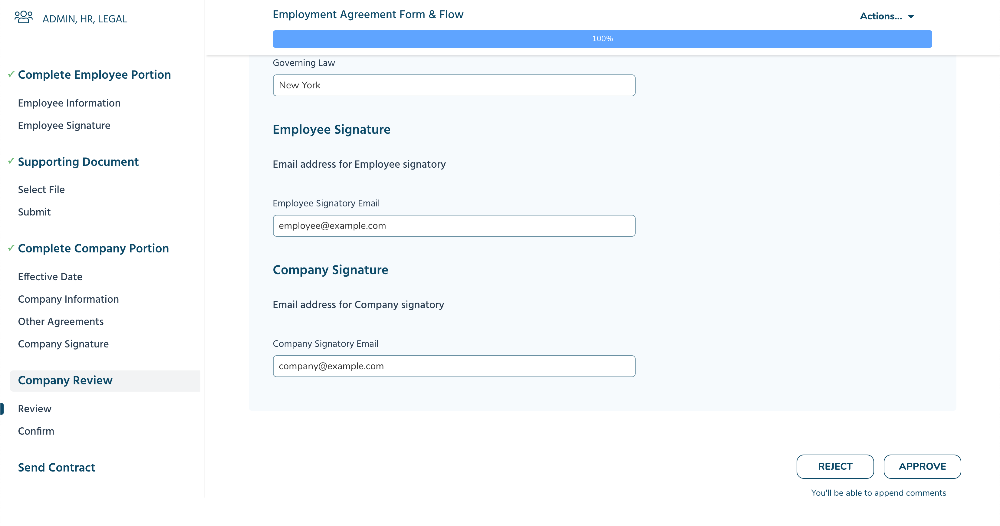
  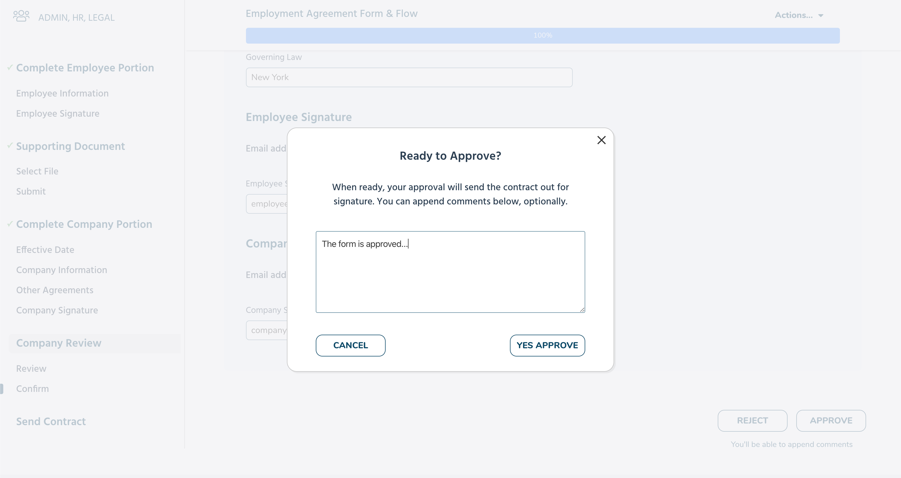
</center>

If all the actions in the workflow have been completed and a `Contract` action has been triggered, the main panel will indicate that the contract is in process and provide a link to view the contract and sign it. In addition, the "Actions" dropdown button in the top header bar includes options to download Word/PDF files of the generated agreement.

<center>
  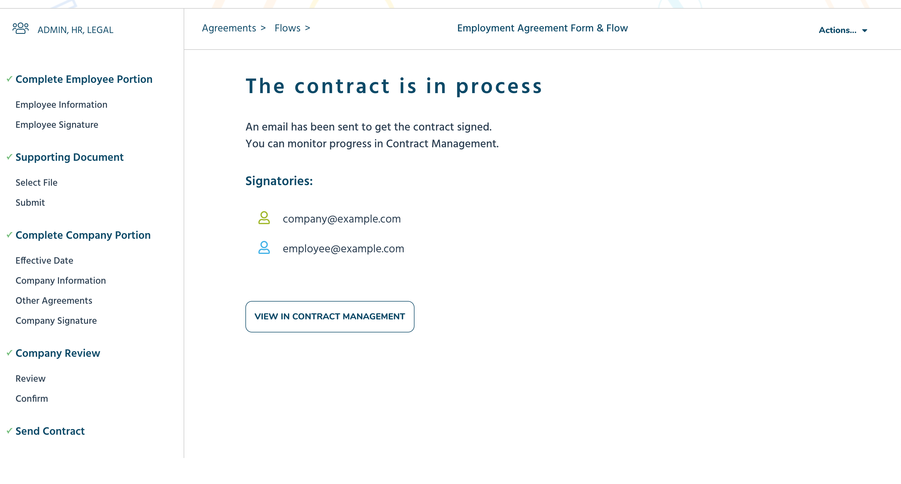
</center>
