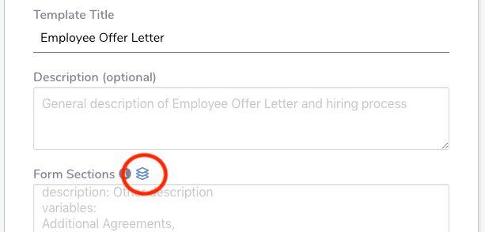
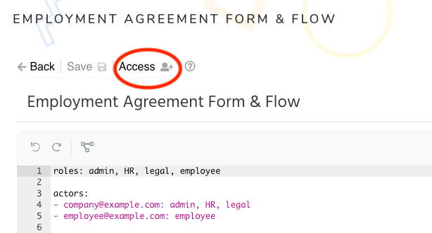
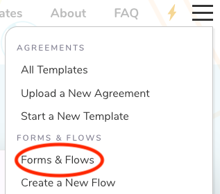
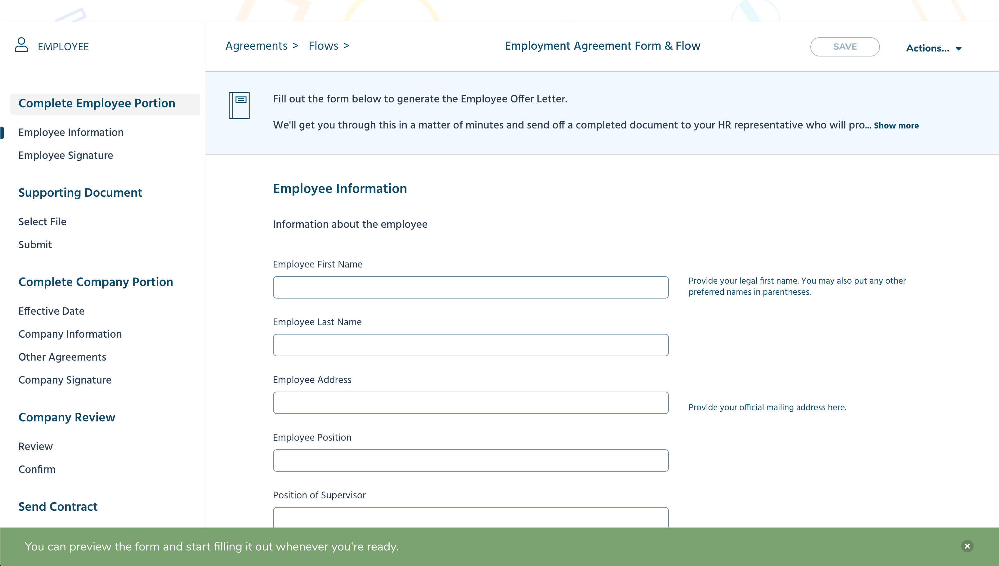
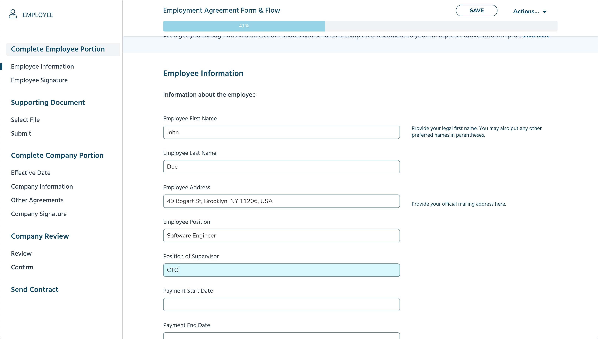

---
meta:
  - name: description
    content: With OpenLaw’s Forms & Flows, you can take any legal agreement and turn it into a questionnaire or simple form. Entire workflows can be created to manage the life cycle of a commercial agreement.
---

# Forms & Flows Overview

The life cycle of commercial arrangements is complex, often requiring multiple people's input and approval to kick things off and different phases of performance. During the process, agreements take too long to prepare, get stuck with "legal" and worse--their valuable data is not plugged into other systems for more productive use.

With OpenLaw's Forms & Flows, you can take any legal agreement and turn it into a questionnaire or simple form in a couple of clicks. Multiple people can fill out the form and entire workflows can be created to manage the life cycle of a commercial agreement.

Commercial relationships no longer need to be complex. Generate agreements, send e-mail reminders about renewals, and save information related to agreements with ease.

## Technical Overview

An agreement template is a great way to define a contract and the actions that should come with it. But sometimes you need an extra layer to define the workflow that happens before the contract is created. This is the main purpose of the Flow. To define how to create contract(s) and what steps need to happen to get there.

### Flow Template

Similar to agreement templates created with our [markup language](/markup-language/), a Flow template has special syntax to create a form view and workflow for an existing agreement template.

A Flow consists of the following elements (with examples of each element for a Flow that is linked to a variation of the Employee Offer Letter template that can be found at https://app.openlaw.io):

#### Title

A unique title to identify the Flow, similar to an agreement template title.

```
Employment Agreement Form & Flow
```

#### Template

A Flow is linked to an already existing agreement template on the same OpenLaw instance where the Flow is created. As further explained below, the Flow can define how the agreement template variables are organized to present a unique form view to the end user. The Flow can also define "edit" actions regarding who can fill out the form and populate the agreement variables.

```
Employee Offer Letter
```

#### Description (optional)

An optional description can be included to give the end user information about the form and workflow, such as the purpose or instructions.

```
Fill out the form below to generate the Employee Offer Letter. We'll get you
through this in a matter of minutes and send off a completed document to your HR
representative who will provide you more information for the hiring process.
```

#### Form Sections

A definition and organization of the variables included in the agreement template. Regardless of how the variables are organized in the agreement template, the variables can be independently defined in a Flow template to customize how they are grouped and in what order they appear in the rendered form. Each form section has a **title**, **description (optional)**, and a listing of **variables**.

```
==
title: Effective Date
description: The date on which the agreement will take effect
variables:
Effective Date
==
title: Company Information
description: Information about the Company and HR representative
variables:
Company Name,
Company Address,
Company Signatory First Name,
Company Signatory Last Name,
Company Signatory Position
==
title: Employee Information
description: Information about the employee
variables:
Employee First Name,
Employee Last Name,
Employee Address,
Employee Position,
Position of Supervisor,
Payment Start Date,
Payment End Date,
Salary in Ether,
Recipient Address,
Employee Responsibilities,
Days of Vacation
==
title: Other Agreements
description: Supporting documents for employment
variables:
Additional Agreements,
Confidentiality Agreement,
Dispute Resolution,
Governing Law
==
title: Signatories
description: Email addresses for signatories
variables:
Company Signatory Email,
Employee Signatory Email
==
```

#### Roles (optional)

List of identifiers that can be assigned to users. Access to actions in a Flow (described below) are given to certain roles.

```
admin, HR, legal, employee
```

#### Actors (optional)

The users who can interact with the Flow execution. Each actor is identified by an email address and has assigned roles that have been defined in the Flow template.

```
- company@example.com: admin, HR, legal
- employee@example.com: employee
```

#### Action (optional and coming soon)

An action is something you can do to a Flow execution. This currently includes editing the parameters (filling out the form fields), sending an email related to the workflow, and providing a required approval in the workflow process. Each action is defined with a name, type (e.g., Edit, Email, Approval), the roles/actors permitted to take the action, and other required information depending on the type.

_Currently, actions can be defined and saved in a Flow template, but their functionalities are still in development._

```
- complete company portion: Edit(
  roles: admin, HR, legal;
  forms: Effective Date, Company Information, Other Agreements, Signatories)
- complete employee portion: Edit(
  roles: employee;
  forms: Employee Information, Signatories)
- send approval email: Email(
  subject: For Your Approval;
  body: "Approval email template";
  to: HR, company@example.com)
- HR approval: Approval(
  roles: HR;
  with attachment: true)
```

#### Action Rules / Flow Graph (optional and coming soon)

The set of rules that define when an action is triggered. Includes references to the actions that have been defined in the Flow template.

_The Flow graph currently can be saved in a Flow template, but its functionality is still in development._

```
when the flow starts then
- requires "complete company portion"
when "complete company portion" is done then
- requires "complete employee portion"
when "complete employee portion" is done then
- do "send approval email"
- requires "HR approval"
when "HR approval" is approved then
- create contract
```

### Full Flow Template Example

The examples above can be combined to create a full Flow template in the editor.

```
roles: admin, HR, legal, employee

actors:
- company@example.com: admin, HR, legal
- employee@example.com: employee

template: Employee Offer Letter

forms:
Fill out the form below to generate the Employee Offer Letter. We'll get you through this in a matter of minutes and send off a completed document to your HR representative who will provide you more information for the hiring process.
==
title: Effective Date
description: The date on which the agreement will take effect
variables:
Effective Date
==
title: Company Information
description: Information about the Company and HR representative
variables:
Company Name,
Company Address,
Company Signatory First Name,
Company Signatory Last Name,
Company Signatory Position
==
title: Employee Information
description: Information about the employee
variables:
Employee First Name,
Employee Last Name,
Employee Address,
Employee Position,
Position of Supervisor,
Payment Start Date,
Payment End Date,
Salary in Ether,
Recipient Address,
Employee Responsibilities,
Days of Vacation
==
title: Other Agreements
description: Supporting documents for employment
variables:
Additional Agreements,
Confidentiality Agreement,
Dispute Resolution,
Governing Law
==
title: Signatories
description: Email addresses for signatories
variables:
Company Signatory Email,
Employee Signatory Email
==

actions:
- complete company portion: Edit(
  roles: admin, HR, legal;
  forms: Effective Date, Company Information, Other Agreements, Signatories)
- complete employee portion: Edit(
  roles: employee;
  forms: Employee Information, Signatories)
- send approval email: Email(
  subject: For Your Approval;
  body: "Approval email template";
  to: HR, company@example.com)
- HR approval: Approval(
  roles: HR;
  with attachment: true)

when the flow starts then
- requires "complete company portion"
when "complete company portion" is done then
- requires "complete employee portion"
when "complete employee portion" is done then
- do "send approval email"
- requires "HR approval"
when "HR approval" is approved then
- create contract
```

### Flow Execution

When a user starts a Flow, a new execution gets created. An execution is linked to its Flow template by a flowId and version. Each Flow execution also has a state. This is where all the information such as the agreement variable inputs and the execution state of the Flow are stored.

### Forms Template

If you don't really have a need for the actions and executions of a fully defined workflow, you still can use the "forms" feature to turn any agreement template into a customizable questionnaire or simple form.

A forms template is a stripped down version of a Flow template with the following implicit default values:

- one actor defined by the user who starts the Flow
- one Edit action on all the available form sections assigned to the only actor

### Forms Template Example

Below is an example of how a forms template can be defined and saved in the editor. Note that the optional **roles**, **actors**, **actions**, and **flow graph** section have been omitted.

```
template: Employee Offer Letter

forms:
Fill out the form below to generate the Employee Offer Letter. We'll get you through this in a matter of minutes and send off a completed document to your HR representative who will provide you more information for the hiring process.
==
title: Effective Date
description: The date on which the agreement will take effect
variables:
Effective Date
==
title: Company Information
description: Information about the Company and HR representative
variables:
Company Name,
Company Address,
Company Signatory First Name,
Company Signatory Last Name,
Company Signatory Position
==
title: Employee Information
description: Information about the employee
variables:
Employee First Name,
Employee Last Name,
Employee Address,
Employee Position,
Position of Supervisor,
Payment Start Date,
Payment End Date,
Salary in Ether,
Recipient Address,
Employee Responsibilities,
Days of Vacation
==
title: Other Agreements
description: Supporting documents for employment
variables:
Additional Agreements,
Confidentiality Agreement,
Dispute Resolution,
Governing Law
==
title: Signatories
description: Email addresses for signatories
variables:
Company Signatory Email,
Employee Signatory Email
==
```

## Creating a Form & Flow

To create a new Flow (with its form view) in an OpenLaw instance, click on "Create a New Flow" in the nav menu.

<center>
  
</center>

To make things easier, we have created a populate modal that breaks down all the required and optional information for you to enter to create a new Flow.

<center>
  
</center>

::: tip
If your Flow is linked to an agreement template that already has [variable groupings](/markup-language/#groupings), you can click on the blue button next to the "Form Sections" label to start with those defined sections.

<center>
  
</center>
:::

After you have submitted the required information in the modal, the Flow syntax will be populated in the editor where you can make further edits before saving and then clicking on the "Back" button to view the created form.

<center>
  
</center>

## Setting Access Permissions

The flow creator can set the access permissions for who can view and edit the Form & Flow by first clicking on the "Access" button at the top of the flow editor.

<center>
  
</center>

In the access permissions modal, you can specify other users to have edit and view access to your created Form & Flow. You can also choose to make edit and/or view permissions available to all registered users.

If you would like to allow unregistered users to view and fill out the form (without edit access), you can generate a shareable link. Anyone who has access to that link can click on it to open the form.

<center>
  
</center>

## Viewing and Filling out of Form

To see the list of forms that you have access to, click on "Forms & Flows" in the nav menu. Check out some examples of created flows at https://app.openlaw.io/flows.

<center>
  
</center>

Filling out a form is straightforward and similar to how you would fill out the fields for an agreement template. The form view includes an action bar at the top that includes various features similar to what you would see for an agreement template.

<center>
  
</center>

As you input information into the form fields, a percentage tracker will automatically update to let you know how far along you are in completing the form.

<center>
  
</center>

After you have completed all of the form fields and have reached the last form section, you will see the percentage tracker indicate "100%" and the convenient options at the bottom to (1) review the agreement, (2) send the contract (available only for a logged in user), and (3) download Word/PDF files of the agreement.

<center>
  
</center>
