# Overview

Creating and publishing high-quality "smart" legal agreements from scratch is a tough task,
but now that you know more about OpenLaw Markup Language you can help us to automate this process.

We’re converting tens of thousands of traditional “legacy” agreements into “blockchain compatible” contracts -
which are markdown files with our markup language.

The goal is to build a huge library of "smart" legal agreements, so you can use any of these base documents and create
your own version without converting a real world contract into markdown format.

There are five main steps that compose this process to build up our library:

1.  Collecting HTML agreements from various sources, such as [LawInsider.com](https://www.lawinsider.com/education);
2.  Parsing and Converting HTML files into OpenLaw Markdown format using Natural Language Processing (NLP);
3.  Uploading markdown files to the Review Tool;
4.  Reviewing all the files to make sure they were properly converted;
5.  Gathering review results to feed the NLP service and improve the conversion process.

With these steps we have a feedback loop that leverages a new flow of information and raises the standards
of the converted files.

The Review Tool is an important piece of this puzzle and now our community can join forces with us and help
to build up this library of agreements.

# How-To

## Sign Up

- [Register](https://conversion.openlaw.io/register)

## Sign In

- [Login](https://conversion.openlaw.io/login)

## Review

### Modes

The Review Tool allows you to decide whether to review a particular agreement or start from where you left off.

    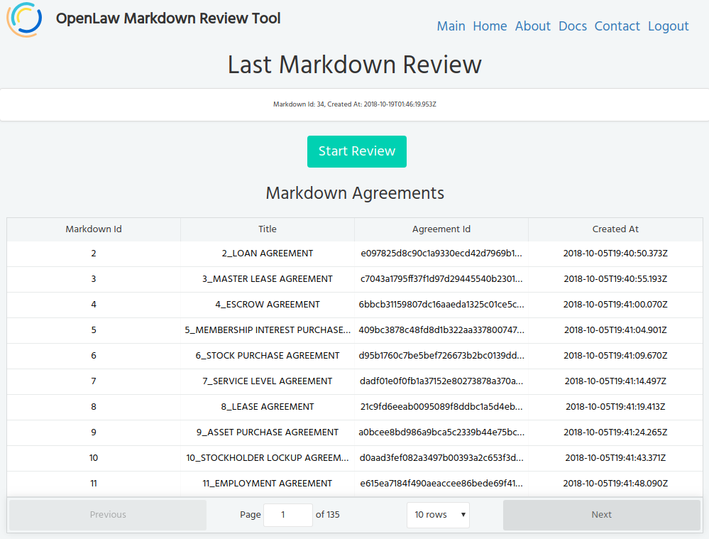

**Starting from where you left**

- Just click on **Begin Review** and it will find the next file available and open the text editor for you.

**Pick any agreement**

- You can select any of the agreement in the table above and then click on **Begin Review** and
  the text editor will be initialized with the content of that agreement.

::: warning

- One agreement can be reviewed by only one user at time.
- The users will always see the latest changes based on previous reviews.
- The maximum time to review an agreement is 30 minutes to prevent users from locking the file forever.
- If you spent more than 30 minutes you will need to start it again by going to the main page and selecting
  the agreement to review it again.
  :::

### Entity Classification

The Review Tool identifies different types of entities and converts them into markdown variables. The first
version detects Organization and Person names. However we often see invalid or partial matches, and that's
why we need to review this information.

The picture bellow shows a partial match of an Organization name, the same might happen for Person names:

    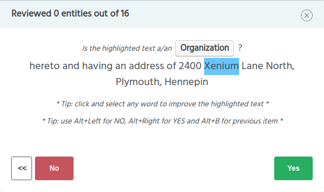

In this case the highlighted words should be `2400 Xenium`, so we need to expand the blue selection to improve
the match and then hit **Yes** to move to the next item. In order to fix the selected text we can simply click
on the text and move the cursor to highlight the correct words.
The final result should look like this:

    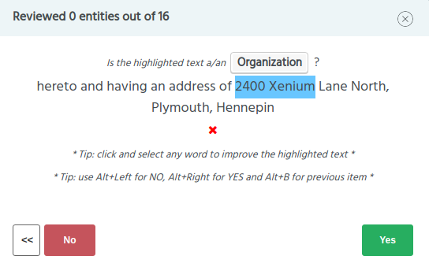

If you want to reset to the initial highlight just click on the red `X`, it will undo the selection.

Moving forward to the second case, sometimes the highlighted text is completely wrong, which means - it is not
an Organization or a Person name. See bellow:

    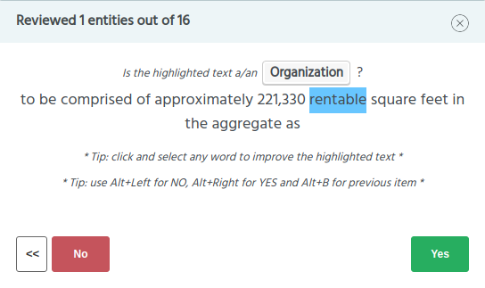

`rentable` is not an Organization or a Person, so click on **No** and set the entity type to `None`.

    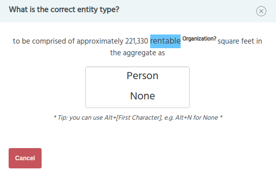

It will indicate that you have found an invalid match its type is not relevant.

The third case happens when the tool finds a proper match but suggests the wrong entity type:

    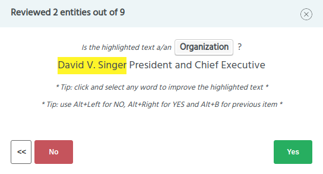

Clearly `David V. Singer` is not an Organization name. Fix the entity type by clicking on button **No**:

    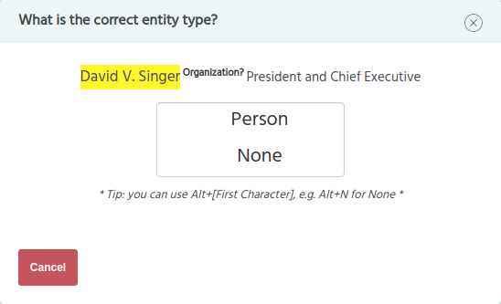

And set correct entity type (`Person`), it will be applied to the text and move to the next item.

At this stage of the review all classified entities will be converted into OpenLaw Markdown variables and applied to
the background text in the editor.

With the variables updated in the editor the Review Tool starts the next task automatically: Variable Renaming.

---

### Variable Renaming

After reviewing the entity matches and types it is time to give a proper name to the variables.
Remember that each entity you have classified in the previous step is converted into a markup variable.
Some of the variables we already converted for you, such as dates and addresses. That's why do not need to classify
these two types.

There are several types of variables to rename. Currently these are the types that are available:

Variable type `Date`:

    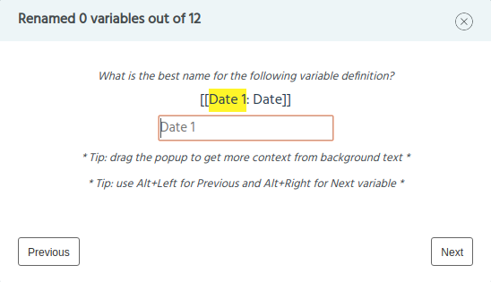

Variable type `Organization`:

    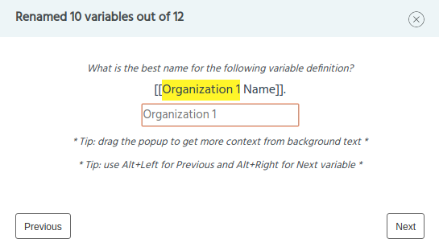

Variable type `Person`:

    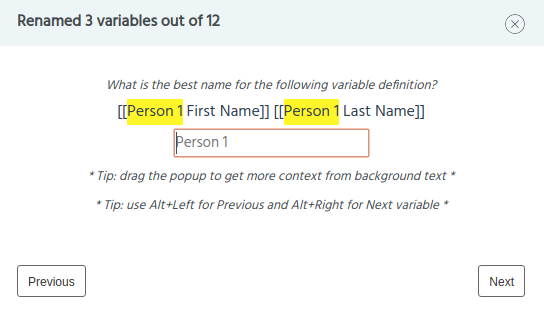

Just fill out the input text with a proper name and it will replace the highlighted in the original
markdown content at the end of this step. If you need more context to choose a name you can simply look at the editor
in the background which surfaces the current variable in review:

    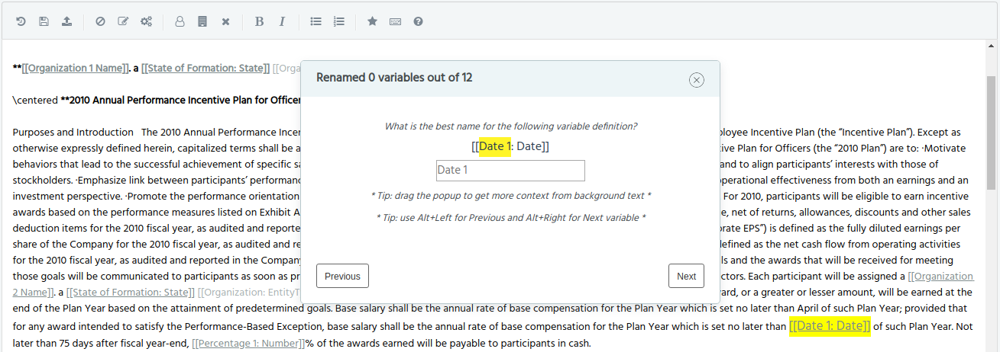

Leave it blank to keep the default name.

After all variables were renamed the tool will move to the next step: Title Suggestion.

---

### Title Suggestion

At this step it asks for title suggestion to the agreement in review.
We often see odd names for these markdown files and in order to improve that we can simply fill out the
input text with a suitable name. Leave it blank to keep the default name.

    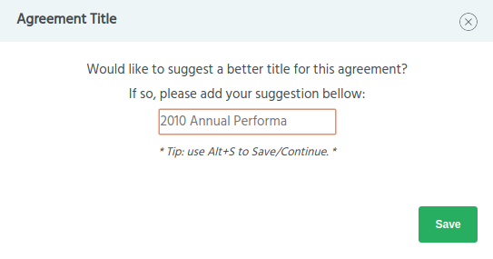

Hit **Save** and all the changes you have suggested will be applied to the editor.

---

### Editor

The text editor allows the option of adding/fixing variables that were not identified during Entity Classification
and Variable Renaming steps.

    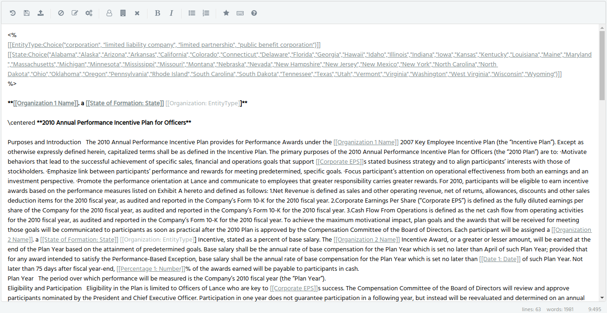

You can add new variables, remove lines and fix variables names in the text. After you finish your
edits the review is ready to be uploaded.

---

### Uploading

The upload process sends to our servers all the decisions you have made along the way and the final version of
the reviewed markdown.

In order to upload the content click on button **Upload Review**. Note: this button becomes available
only if you have completed the task 1 (Entity Classification) at least.

After the review is uploaded the editor changes the state to read only mode. So you will not be able to
edit the text anymore. Make sure you do all the edits before publishing the review.

If you have to add anything else after you have submitted, go back to home page and select the exact same
agreement to start a new review round. The new review round will start with your latest changes, so you
can edit the file and upload it again.

---

### Feedback

For each uploaded review the tool asks some feedback about the process. It is completely optional
but your feedback help us to improve it.

    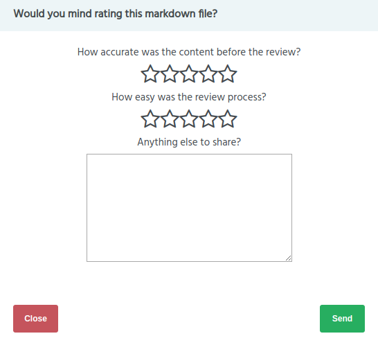

You can also submit feedback at anytime by clicking on the **Star** icon in the editor's toolbar.

---

### Blacklist

We often see markdowns with content that are not useful for us: missing important information,
the text is confusing, lots of invalid characters, etc. For these cases we can add the markdown to a
blacklist by clicking on **Blacklist** button.

Once the markdown is blacklisted, you won't be able to edit and review it anymore. Just move to **Next**.

    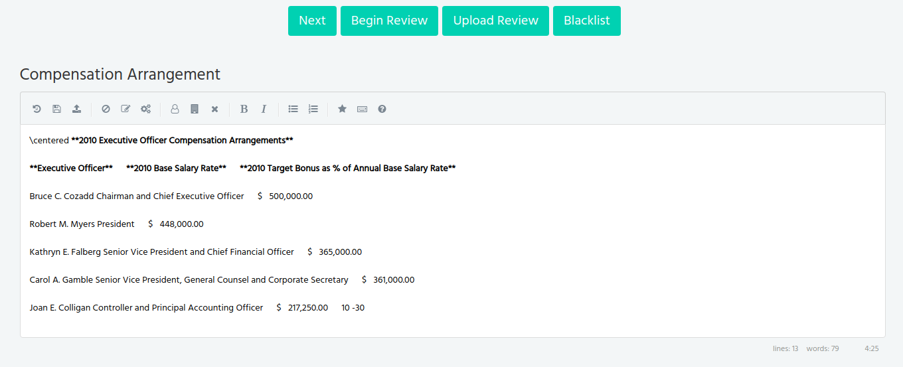

---

### Next

The **Next** button finds the next file available for review. You can navigate through the files
queue using it until you get an agreement that you want to analyze.

Every time you open a new file you lock that file for 30 minutes, as mentioned before, this is the maximum time
it holds the file for your review. Usually the review does not take more than 10 minutes.
