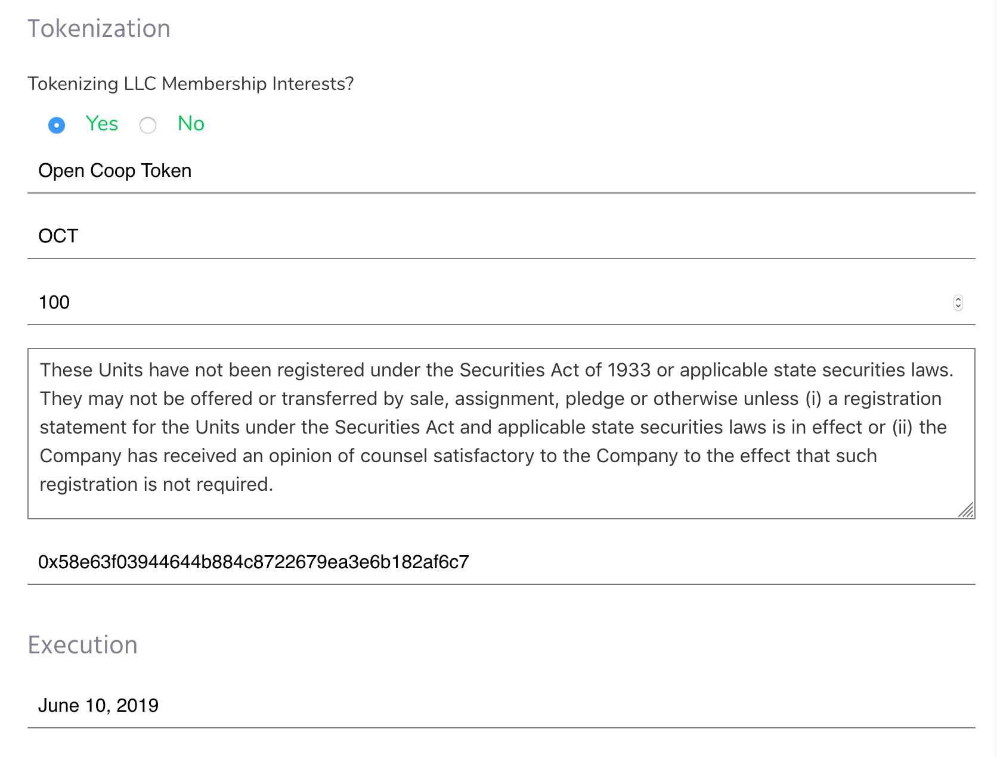
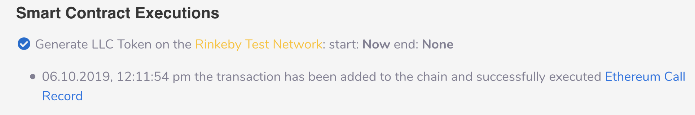
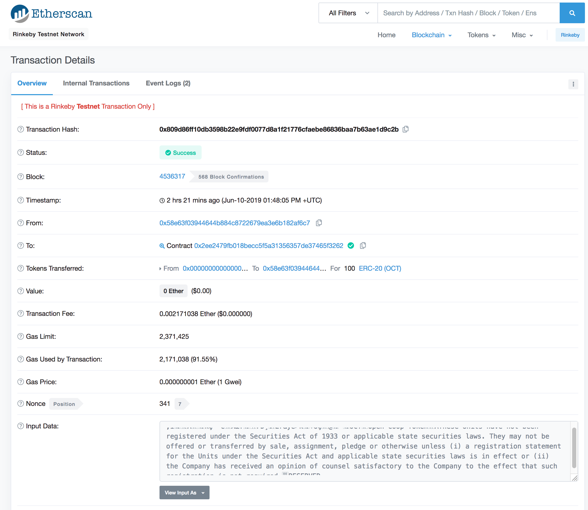

---
meta:
  - name: description
    content: OpenLaw's Token Forge effectively allows OpenLaw users to seamlessly upload assets from their agreements by timestamping "calls" to factories that generate associated digital artifacts ("Tokens") on the Ethereum blockchain.
---

# Token Forge Overview

In addition to providing natural language templates to execute standard legal agreements and efficiently create binding legal commitments, OpenLaw is integrated with templates for common smart contract "factories" to originate and manage digital assets, including ERC-20/ERC-721 generation with OpenLaw's Token Forge.

Among other benefits to automate aspects of legal agreement entry and performance, Token Forge effectively allows OpenLaw users to seamlessly **_upload assets_** from their agreements by timestamping "calls" to factories that generate associated digital artifacts ("Tokens") on the Ethereum blockchain. These Tokens can bear a range of permissions and agreement data, such as initial Token custody, vesting, and public legal description(s).

## Creating a Token

By integrating the below call to the OpenLaw Token Forge, users can generate a customizable ERC-20 Token that can be stored in Ethereum smart contracts and traded globally with automated settlement:

```
<%
[[Generate Token:EthereumCall(
contract:"0x2Ee2479FB018BEcc5f5A31356357De37465f3262";
interface:[{"constant": false,"inputs": [{"name": "symbol","type": "string"},{"name": "name","type": "string"},{"name": "totalSupply","type": "uint256"},{"name": "_owner","type": "address"},{"name": "legend","type": "string"},{"name": "url","type": "string"}],"name": "newMintableToken","outputs": [{"name": "newContract","type": "address"}],"payable": false,"stateMutability": "nonpayable","type": "function"}];
network:"Rinkeby";
function:"newMintableToken";
arguments: Token Symbol, Token Name, Initial Amount in Wei, TokenHolder EthAddress, Token Legend, Token URL)]]
%>

[[Generate Token]]
```

Following execution of an integrated template, the Token Forge will pass user variables to the designated ERC-20 factory (here, `0x2Ee2479FB018BEcc5f5A31356357De37465f3262`) to create a digital artifact that reflects the underlying agreement such as the Name, Symbol, and the EthAddress that will hold the Initial Amount of Tokens that bear additional public information, such as Legend and URL that can be later updated.

## Incorporating Token Generation into Legal Agreement

Below is a sample agreement that brings everything together. To experiment, click on "Start a New Template" in the nav menu:

<center>
  
</center>

Then paste the following into the editor:

```
<%
==Formation Jurisdiction==
[[Offshore]]

==Company Info==
[[Company Name]]
[[Company Office Address: Address]]

==Member Info==
[[Member Name]]
[[Member Email: Identity]]
[[Member Capital Contribution: LargeText]]

==Tokenization==
[[Tokenization]]
[[Token Name]]
[[Token Symbol]]
[[Initial Amount: Number(100)]]
[[Token Legend: LargeText("These Units have not been registered under the Securities Act of 1933 or applicable state securities laws. They may not be offered or transferred by sale, assignment, pledge or otherwise unless (i) a registration statement for the Units under the Securities Act and applicable state securities laws is in effect or (ii) the Company has received an opinion of counsel satisfactory to the Company to the effect that such registration is not required.")]]
[[TokenHolder EthAddress: EthAddress("0x58E63f03944644b884c8722679Ea3E6B182af6C7")]]

[[@Adjusted Initial Amount = Initial Amount * 1000000000000000000]]

==Execution==
[[Effective Date: Date]]
%>
{{Tokenization "Tokenizing LLC Membership Interests?" =>
<%
# Smart Contract Call(s):
[[Generate LLC Token:EthereumCall(
contract:"0x2Ee2479FB018BEcc5f5A31356357De37465f3262";
interface:[{"constant": false,"inputs": [{"name": "symbol","type": "string"},{"name": "name","type": "string"},{"name": "totalSupply","type": "uint256"},{"name": "_owner","type": "address"},{"name": "legend","type": "string"},{"name": "url","type": "string"}],"name": "newMintableToken","outputs": [{"name": "newContract","type": "address"}],"payable": false,"stateMutability": "nonpayable","type": "function"}];
network:"Rinkeby";
function:"newMintableToken";
arguments: Token Symbol, Token Name, Adjusted Initial Amount, TokenHolder EthAddress, Token Legend, "RESERVED")]]
%>
}}

\centered **LIMITED LIABILITY COMPANY OPERATING AGREEMENT**
\centered **OF [[Company Name | Uppercase]] LLC ({{Offshore "Forming offshore LLC?" => A CAYMAN ISLANDS LIMITED LIABILITY COMPANY :: A NEW YORK LIMITED LIABILITY COMPANY}})**

\centered - ***Dated as of [[Effective Date]]*** -

**THIS LIMITED LIABILITY COMPANY AGREEMENT** (this "***Agreement***"), has been executed by the member (the "***Member***") set forth on *Exhibit A* annexed hereto, for the purposes of setting forth the rights and obligations of the Member in and to [[Company Name]] LLC (the "***Company***") formed pursuant to the provisions of the {{Offshore => Cayman Islands Limited Liability Companies Law, 2016 :: New York Limited Liability Company Law}} (the "***Act***").

**1. 	ARTICLE 1: THE COMPANY AND ITS BUSINESS**

**1.1.   Formation of Company.**  The Company was formed pursuant to the provisions of the Act. The rights and liabilities of the Member, the management of the affairs of the Company and the conduct of its business shall be as provided in the Act, except as otherwise expressly provided herein.

**1.2.   Name.**  The name of the Company shall be [[Company Name]] LLC, however, the Member, subject to the terms of this Agreement, may change the name of the Company at any time and from time to time.

**1.3.   Term of Company.**  The term of the Company commenced upon the filing of the appropriate formation documents with the {{Offshore => Registrar of Limited Liability Companies :: Department of State of the State of New York}} in accordance with the Act and shall continue until terminated in accordance with this Agreement or as provided by law.

**1.4.   Purposes of Company.**  The purpose of the Company is to: (i) engage in any lawful act or activity for which limited liability companies may be organized under the Act; and (ii) do all things necessary, suitable or proper for the accomplishment of, or in the furtherance of the Company's business.

**1.5.   Offices.**  The Company shall maintain its primary office and principal place of business at [[Company Office Address]], or at such other places of business or Ethereum blockchain network address(es) as the Member deems advisable for the conduct of the Company's business, and may from time to time change the Company's primary office and network address(es) in furtherance of the same.

**2. 	ARTICLE 2: CAPITALIZATION**

**2.1.   Capital Contributions.** The Member shall make such capital contributions, consisting of cash, digital assets, real or personal property, to the Company as he, she, or it deems appropriate from time to time. The Member's initial capital contribution shall be provided on *Exhibit A* annexed hereto.

**2.2.   Liability of Member and Affiliates.** Except as otherwise provided by applicable law, the debts, obligations and liabilities of the Company, whether arising in contract, tort or otherwise, shall be solely the debts, obligations and liabilities of the Company. Neither the Member, any person affiliated with the Member nor any officer of the Company shall be obligated personally for any such debt, obligation or liability of the Company solely by reason of being the Member, an affiliate of the Member or an officer of the Company.

**3. 	ARTICLE 3: PROFITS AND LOSSES; DISTRIBUTIONS**

**3.1.   Profit and Losses.** All profits and losses of the Company will be allocated to the Member.

**3.2.   Distributions.** All distributions of cash, digital assets, property, profits or otherwise and the timing thereof will be made at the discretion of the Member.

**4. 	ARTICLE 4: MANAGEMENT**

**4.1.   Management by the Member.** The business and affairs of the Company shall be managed by the Member. The Member shall have full power and authority to take any action and execute any documents or digital transactions on behalf of the Company. The Member is hereby designated as the sole manager of the Company. The Member is the agent of the Company for the purpose of the Company's business, and for the purpose of the execution in the name of the Company of any instrument for carrying on in the usual way the business of the Company. The Member's acts bind the Company, unless such act is in contravention of the Act or this Agreement.

**4.2.   Expenses.** The Company shall pay all of its own operating, overhead and administrative expenses of every kind. The Member and the officers of the Company shall be reimbursed for all reasonable costs and expenses they may have incurred or may hereafter incur on behalf of the Company.

**4.3.   Officers.** The Member shall have the right to delegate any portion of his, her, or its duties (as the Member may determine) to officers or to other persons; provided, however, that no such delegation of authority shall relieve the Member of his, her, or its obligations hereunder. The Member may, from time to time, designate or appoint one or more officers of the Company, including, without limitation, one or more chairmen, a vice chairman, a chairman emeritus, a chief executive officer, a president, one or more vice presidents, a secretary, an assistant secretary, and/or a treasurer. Such officers may, but need not be, employees of the Company, or an affiliate of the Company. Each appointed officer shall hold office until: (i) his/her successor is appointed by the Member; (ii) such officer submits his/her resignation; or (iii) such officer is removed, with or without cause, by the Member. All officers shall have the authority to perform duties to conduct the day to day operations of the Company consistent with and in the ordinary course of its business, subject to the terms and provisions of this Agreement and to the direction and authorization of the Member. Each officer shall perform his/her duties as an officer in good faith and with such degree of care, which an ordinarily prudent person in a like position would use under similar circumstances.

**4.4.   Indemnity**

**4.4.1. Limitation of Liability.**  Neither the Member nor any officer of the Company shall be liable to the Company for any loss or damages resulting from errors in judgment or for any acts or omissions that do not constitute willful misconduct or gross negligence. In all transactions for or with the Company, the Member and the officers of the Company shall act in good faith and in a manner believed to be in the best interests of the Company.

**4.4.2. Settlement of Claims.** The Company, its receiver or its trustee, as the case may be (but not the Member personally), shall indemnify and defend the Member and the officers of the Company against and hold them harmless from any and all losses, judgments, costs, damages, liabilities, fines, claims and expenses (including, but not limited to, reasonable attorneys fees and court costs, which shall be paid by the Company as incurred) that may be made or imposed upon such persons and any amounts paid in settlement of any claims sustained by the Company by reason of any act or inaction which is determined by the Member or the officers of the Company, as the case may be, in good faith to have been in the best interests of the Company so long as such conduct shall not constitute willful misconduct or gross negligence.

**4.4.3. Indemnified Matters.** In the event of settlement of any action, suit or proceeding brought or threatened, such indemnification shall apply to all matters covered by the settlement except for matters as to which the Company is advised by counsel retained by the Company that the person seeking indemnification, in the opinion of counsel, did not act in good faith. The foregoing right of indemnification shall be in addition to any rights to which the Member or the officers of the Company may otherwise be entitled and shall inure to the benefit of the executors, administrators, personal representatives, successors or assigns of each such person.

**4.4.4. Indemnification Limited To Company Assets.** Any right of indemnity granted under this *Section 4.4.* may be satisfied only out of the assets of the Company, and neither the Member nor any officer of the Company shall be personally liable with respect to any such claim for indemnification.

**4.4.5. Liability Insurance.** The Member shall have the power to purchase and maintain insurance in reasonable amounts on behalf of itself and the officers, employees and agents of the Company against any liability incurred by them in their capacities as such, whether or not the Company has the power to indemnify them against such liability.

**5. 	ARTICLE 5: BOOKS AND RECORDS**

**5.1.   Books of Account.** Complete books of account shall be kept by the Member at the principal office of the Company or at such other office or Ethereum blockchain network address(es) as the Member may designate, under such methods of accounting as the Member may select. The Company's accounting period shall be the calendar year.

**5.2.   Bank Accounts.** The Member may maintain one or more bank accounts or multisignature digital wallets for such funds and/or digital assets of the Company as he, she, or it shall choose to deposit therein, and withdrawals therefrom shall be made upon such signature or signatures as the Member shall determine.

**5.3.   Tax Election.** The Member shall have the authority to cause the Company to make any election required or permitted to be made for income tax purposes if the Member determines, in his, her, or its sole judgment, that such election is in the best interests of the Company.

**5.4.   Tax Matters.** The Member shall be the tax matter partner of the Company, and it or its authorized agent, shall be the only person authorized to prepare, execute and file tax returns and tax reports on behalf of the Company and to represent the Company before the Internal Revenue Service and any state or local taxing authority.

**5.5.   Title to Assets.** Title to, and all right and interest in and to, the Company's assets, shall be acquired in the name of and held by the Company, or if acquired in any other name, held for the benefit of the Company.

**5.6.   Bankruptcy of the Member.** The bankruptcy of the Member will not cause the Member to cease to be a Member of the Company, and upon the occurrence of such event, the Company shall continue without dissolution.

**6. 	ARTICLE 6: DISSOLUTION AND TERMINATION**

**6.1.   Dissolution.** The Company shall be dissolved and terminated upon the earliest to occur of the following:

**6.1.1.** the entry of a decree of judicial dissolution of the Company; or

**6.1.2.** when the provisions of *Section 6.3* below have been met; or

**6.1.3.** the retirement, resignation or dissolution of the Member or the occurrence of any other event that terminates the continued membership of the Member unless the business of the Company is continued in a manner permitted under the Act; or

**6.1.4.** when otherwise determined by the Member.

**6.2.   Distribution of Assets.** In the event of dissolution, the Company shall conduct only such activities as are necessary to wind up its affairs (including the sale of the assets of the Company in an orderly manner), and the assets of the Company shall be applied in the manner, and in the order of priority, as set forth under the Act.

**6.3.  Termination.** The Company shall terminate when all property (including digital assets) owned by the Company shall have been disposed of and the assets, after payment of, or due provision has been taken for, liabilities to Company creditors, shall have been distributed. Upon such termination, the Member or the Company's officers shall execute and cause to be filed all documents necessary in connection with the termination of the Company.

**7. 	ARTICLE 7: MISCELLANEOUS**

**7.1.   Assignments.** The Member may assign in whole or in part his, her, or its interest in the Company on such terms and conditions as the Member determines, in his, her, or its sole discretion.

**7.2.   Admission of Additional Member.** One or more additional member(s) may be admitted to the Company with the prior written consent of the Member (which may be represented by authorized digital transactions).

**7.3.   Severability.** If any of the provisions of this Agreement is held invalid or unenforceable, such invalidity or unenforceability shall not affect the other provisions hereof which can be given effect without the invalid provision, and to this end the provisions of this Agreement are intended to be and shall be deemed severable.

**7.4.   Governing Law.** This Agreement shall be governed and construed in accordance with the laws of the State of New York without regard to the conflicts of law rules of said state.

**7.5.   Amendments.** This Agreement may be amended or modified from time to time only upon the written consent of the Member (which consent may be evidenced by the execution of an amendment and restatement of this Agreement and/or authorized digital transactions).

**7.6.   No Third Party Beneficiaries.** None of the provisions of this Agreement shall be for the benefit of or enforceable by any of the creditors of the Company or any other person not a party to this Agreement.
\pagebreak

**IN WITNESS WHEREOF,** the undersigned Member caused this counterpart signature page to this Limited Liability Company Agreement to be duly executed and this Agreement to become effective as of the date first above written.


**MEMBER**
[[Generate LLC Token]]
*[[Member Email: Identity | Signature]]*
_______________________
**[[Member Name]]**


\pagebreak
\centered **EXHIBIT A: Member Capital Contribution**

| Member Name | Capital Contribution |
| --------- | --------- |
| [[Member Name]] | [[Member Capital Contribution: LargeText]] |

{{Tokenization =>
\pagebreak
\centered **EXHIBIT B: Tokenized Membership Units**

Name: **[[Token Name]]**

Symbol: **[[Token Symbol]]**

Amount: **[[Initial Amount]]**

Owner: *0x[[TokenHolder EthAddress]]*

Legend: *[[Token Legend]]*
}}
```

Once complete, you'll see a form such as the following (_user inputs details for OpenLaw Token Foundry to generate custom ERC-20 Token for LLC Membership_):

<center>
  
</center>

Following agreement execution, anyone can audit [public record](https://rinkeby.etherscan.io/tx/0x809d86ff10db3598b22e9fdf0077d8a1f21776cfaebe86836baa7b63ae1d9c2b) of timestamped ERC-20 generation on the Ethereum blockchain related to OpenLaw Token Foundry, including the restrictive legend attached to the ERC-20 Token:

<center>
  
</center>

<center>
  
</center>

## Other Token Standards

OpenLaw's Token Forge works with any token factory contract, including ERC-223, ERC-721, and ERC-1400. Some example calls are listed below.

### ERC-223

```
<%
[[Generate ERC223:EthereumCall(
contract:"0x3575836fd4d5990c2dc4A7352DA5379BCc3b6cfB";
interface:[{"constant":true,"inputs":[{"name":"","type":"uint256"}],"name":"contracts","outputs":[{"name":"","type":"address"}],"payable":false,"stateMutability":"view","type":"function"},{"constant":false,"inputs":[{"name":"name","type":"string"},{"name":"symbol","type":"string"}],"name":"newERC20_223","outputs":[{"name":"newContract","type":"address"}],"payable":false,"stateMutability":"nonpayable","type":"function"}];
network:"Rinkeby";
function:"newERC20_223";
arguments: Test ERC223 Name, Test ERC223 Symbol)]]
%>

[[Generate ERC223]]
```

### ERC-721

```
<%
[[Generate Mintable NFT:EthereumCall(
contract:"0x6ec76ee8452b3087d20da8de91b986952ec7b838";
interface:[{"constant": false,"inputs": [{"name": "_name","type": "string"},{"name": "_symbol","type": "string"}],"name": "newStandardNFT","outputs": [{"name": "newContract","type": "address"}],"payable": false,"stateMutability": "nonpayable","type": "function"}];
network:"Rinkeby";
function:"newStandardNFT";
arguments:NFT Name, NFT Symbol)]]
%>

[[Generate Mintable NFT]]
```
